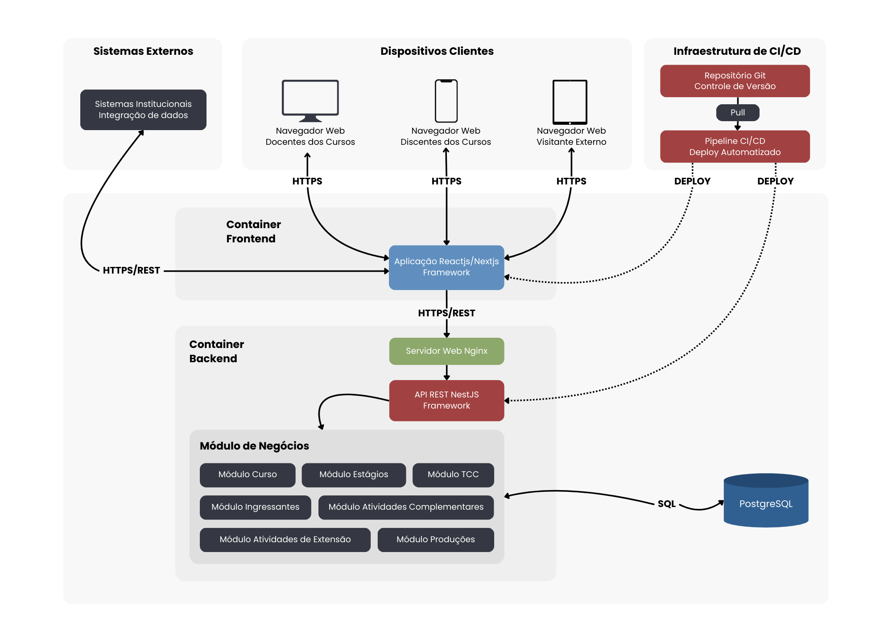

# 🧭 Visão Geral do Sistema

O **UniDash** é um sistema web desenvolvido para apoiar a gestão acadêmica de cursos de graduação em instituições públicas.
Sua principal função é consolidar dados acadêmicos em dashboards interativos, permitindo visualizar indicadores institucionais, acompanhar o desempenho dos cursos e auxiliar na tomada de decisões estratégicas.

<br>

<a href="docs/deployment-diagrams/deployment-v1.png" style>
  
</a>

<br><br>

# 📚 Estrutura Geral do Projeto

```
/ (repo root)
├─ backend/         # API Rest
├─ frontend/        # Interface web
└─ docs/            # Diagramas, documentação, modelos ER, etc.
```

---

<br>

Antes de executar o projeto, certifique-se de ter instalado:

| Requisito             | Versão recomendada |
| --------------------- | ------------------ |
| 🐳 **Docker**         | 20+                |
| 📦 **Docker Compose** | 1.29+              |

<br><br>

# 🏗️ Executando o Backend

### 📁 1. Acesse a pasta do backend

```bash
cd backend
```

### ⚙️ 2. Crie o arquivo `.env`

Antes de rodar o backend, é necessário criar um arquivo `.env` na raiz da pasta **backend**, usando como base o arquivo **`.env.example`**:

```bash
cp .env.example .env
```

Edite o `.env` conforme necessário (credenciais do banco, portas, configurações específicas etc.).

### ▶️ 3. Execute o Docker Compose

```bash
docker compose up --build
```

### 🔍 Observações

- O backend normalmente expõe a API em `http://localhost:3333`.
- O Docker Compose também sobe o container do banco PostgreSQL, garantindo que a aplicação tenha acesso ao ambiente completo.
- Após o build inicial, os próximos `up` serão significativamente mais rápidos.

<br><br>

# 🎨 Executando o Frontend

### 📁 1. Acesse a pasta do frontend

```bash
cd frontend
```

### ⚙️ 2. Crie o arquivo `.env`

Assim como no backend, é necessário criar o arquivo `.env` baseado no **`.env.example`**:

```bash
cp .env.example .env
```

Edite o arquivo conforme suas configurações (por exemplo, a URL da API).

### ▶️ 3. Execute o Docker Compose

```bash
docker compose up --build
```

### 🔍 Observações

- O frontend estará disponível em `http://localhost:3000`.
- Após o build inicial, os próximos `up` serão significativamente mais rápidos.
